# Autoresearch Explained

> A complete guide for engineers who aren't ML specialists.
> By Andrej Karpathy's project, explained with analogies, diagrams, and plain language.

---

## Table of Contents

1. [The Big Picture: What Is This?](#1-the-big-picture-what-is-this)
2. [Repository Structure](#2-repository-structure)
3. [The Experiment Loop: How the AI Does Research](#3-the-experiment-loop-how-the-ai-does-research)
4. [Data Pipeline: From Raw Text to Numbers](#4-data-pipeline-from-raw-text-to-numbers)
5. [The GPT Model: A Layered Machine](#5-the-gpt-model-a-layered-machine)
6. [Attention: The Core Mechanism](#6-attention-the-core-mechanism)
7. [Positional Encoding: How the Model Knows Word Order](#7-positional-encoding-how-the-model-knows-word-order)
8. [The MLP: The Thinking Step](#8-the-mlp-the-thinking-step)
9. [Special Tricks in This Model](#9-special-tricks-in-this-model)
10. [The Optimizer: How the Model Learns](#10-the-optimizer-how-the-model-learns)
11. [The Training Loop: Putting It All Together](#11-the-training-loop-putting-it-all-together)
12. [The Metric: val_bpb](#12-the-metric-val_bpb)
13. [Hyperparameters Cheat Sheet](#13-hyperparameters-cheat-sheet)
14. [Glossary](#14-glossary)

---

## 1. The Big Picture: What Is This?

### The Analogy

Imagine you're an engineer designing a robot arm. You have a test bench that evaluates each design in 5 minutes. Now imagine you hire a tireless assistant who:

1. Tweaks the robot arm design (changes a gear ratio, adds a sensor, etc.)
2. Runs the 5-minute test
3. If the test score improves, **keeps** the change
4. If it doesn't improve, **reverts** the change
5. Goes back to step 1, **forever**, while you sleep

That's **autoresearch**. Except instead of a robot arm, the "design" is a **neural network that predicts text** (a small GPT model), and the "assistant" is an AI agent (like Claude or Codex).

### What's Actually Happening

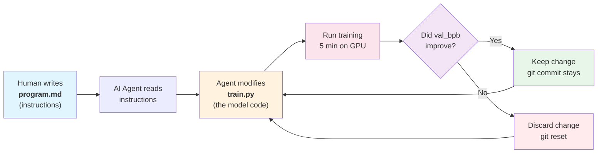

### The Key Insight

The human doesn't write Python code. The human writes **instructions** (`program.md`) for the AI agent. The AI agent writes the actual Python. It's like programming the programmer instead of programming the program.

---

## 2. Repository Structure

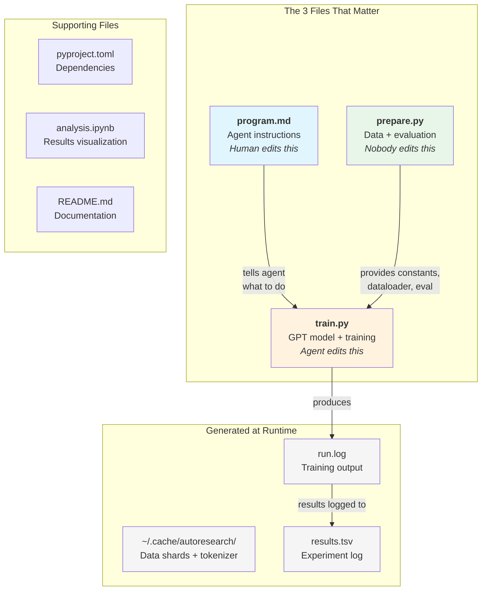

### What Each File Does

| File | Who edits it | Purpose |
|------|-------------|---------|
| `program.md` | Human | Instructions for the AI agent (like a job description) |
| `train.py` | AI agent | The GPT neural network, optimizer, and training loop (~630 lines) |
| `prepare.py` | Nobody (read-only) | Downloads data, trains tokenizer, provides dataloader and the evaluation function |
| `pyproject.toml` | Nobody | Lists Python dependencies (PyTorch, tiktoken, etc.) |
| `results.tsv` | AI agent (created at runtime) | Tab-separated log of all experiment results |

---

## 3. The Experiment Loop: How the AI Does Research

### Mechatronics Analogy

Think of it like a **PID tuning loop**, but instead of tuning 3 gains (Kp, Ki, Kd), the AI is tuning an entire neural network architecture and its hyperparameters. And instead of a human watching an oscilloscope, the metric (`val_bpb`) tells the AI if the change was good or bad.

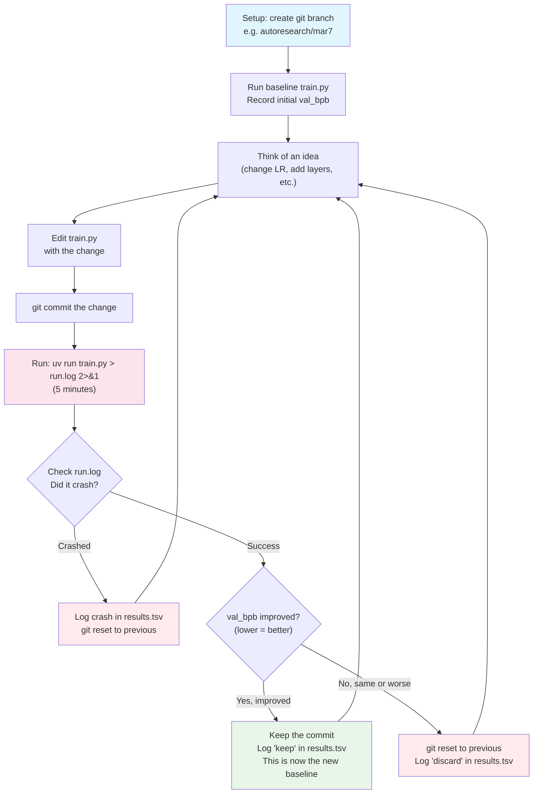

### The results.tsv File

Every experiment gets logged. It looks like this:

```
commit   val_bpb    memory_gb  status   description
a1b2c3d  0.997900   44.0       keep     baseline
b2c3d4e  0.993200   44.2       keep     increase LR to 0.04
c3d4e5f  1.005000   44.0       discard  switch to GeLU activation
d4e5f6g  0.000000   0.0        crash    double model width (OOM)
```

The AI runs ~12 experiments per hour. Leave it running overnight = ~100 experiments by morning.

---

## 4. Data Pipeline: From Raw Text to Numbers

### The Problem

Neural networks can't read text. They only understand numbers (tensors). So we need to convert:

```
"Hello world" --> [4521, 873] --> neural network --> [probability of next word]
```

### The Analogy

Think of it like an **encoder wheel** in a motor. Each position maps to a specific number. A **tokenizer** is like an encoder for text: each common word or word-piece gets a unique number (called a "token ID").

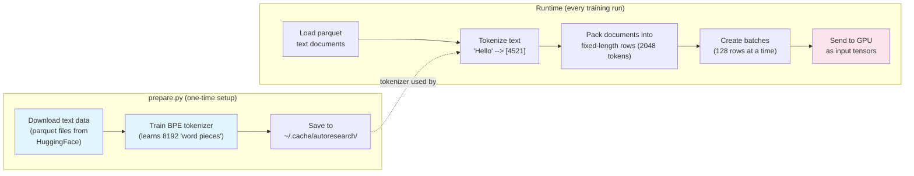

### What is BPE (Byte Pair Encoding)?

Imagine you have a book and you want to compress it. BPE works like this:

1. Start with individual characters: `h`, `e`, `l`, `l`, `o`
2. Find the most common pair: `l` + `l` appears a lot, merge them into `ll`
3. Repeat: `he` is common, merge into `he`
4. Keep going until you have 8,192 "pieces" (the vocabulary size)

So common words like "the" get one token, while rare words like "pneumonoultramicroscopicsilicovolcanoconiosis" get split into many tokens.

### Best-Fit Packing (the Dataloader)

The model needs fixed-length inputs (2048 tokens). But documents have different lengths. The dataloader solves this like a **bin packing problem** (like fitting boxes into a shipping container):

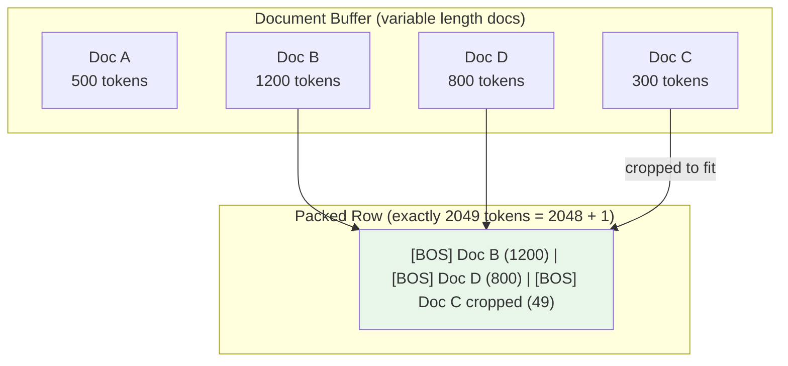

- Every document starts with a BOS (Beginning Of Sequence) token
- The packer finds the largest document that fits in remaining space
- If nothing fits, it crops the shortest document to fill exactly
- Result: 100% utilization, no wasted space (no padding)

---

## 5. The GPT Model: A Layered Machine

### The Analogy

Think of the GPT model as a **signal processing pipeline**, like a multi-stage filter in signal processing or a cascade of controllers in a control system. Each "block" (stage) refines the signal further.

```
Raw tokens in --> [Block 0] --> [Block 1] --> ... --> [Block 7] --> Predicted next token out
```

### Architecture Overview

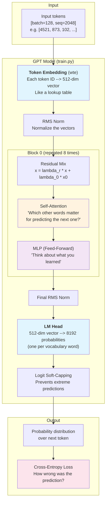

### How Dimensions Work

This is a common confusion point. Here's a concrete example with the default config:

```
DEPTH = 8 layers
ASPECT_RATIO = 64
HEAD_DIM = 128

model_dim = DEPTH * ASPECT_RATIO = 8 * 64 = 512
  (rounded up to nearest multiple of HEAD_DIM = 512, already aligned)
num_heads = model_dim / HEAD_DIM = 512 / 128 = 4 attention heads
```

So each token is represented as a **512-dimensional vector** (like coordinates in a 512-dimensional space). The model has 4 attention heads, each working with 128 dimensions.

### The Data Flow Through the Model

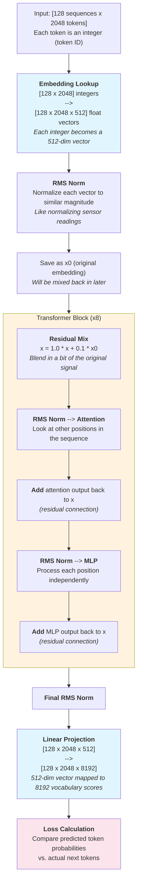

---

## 6. Attention: The Core Mechanism

### The Analogy

Imagine you're reading a sentence: **"The cat sat on the mat because it was tired"**

When you read "it", your brain automatically looks back and connects "it" to "cat" (not "mat"). **Attention** is the mechanism that lets the model do this -- it decides which earlier words are relevant to each current word.

### How It Works (Simplified)

For each word, the model creates three vectors:
- **Query (Q)**: "What am I looking for?" (like a search query)
- **Key (K)**: "What do I contain?" (like a search index)
- **Value (V)**: "What information do I carry?" (like the search result)

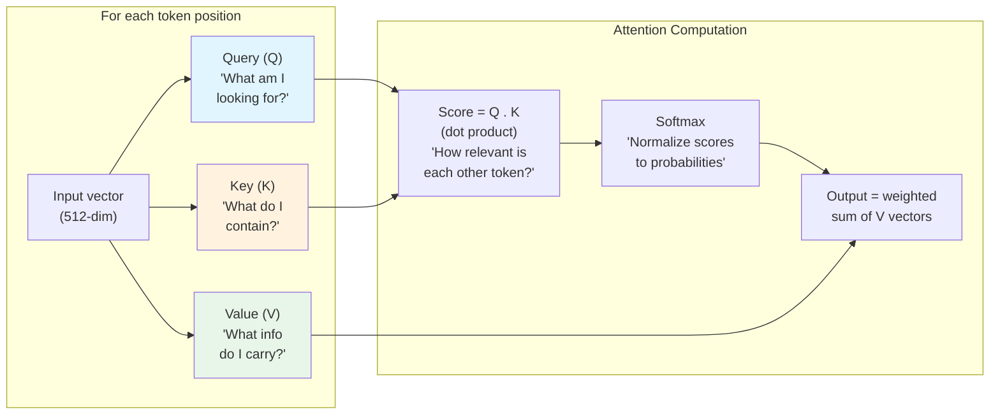

### Multi-Head Attention

Instead of one attention computation, the model runs **4 in parallel** (4 heads, each with 128 dimensions). Each head can focus on different types of relationships:

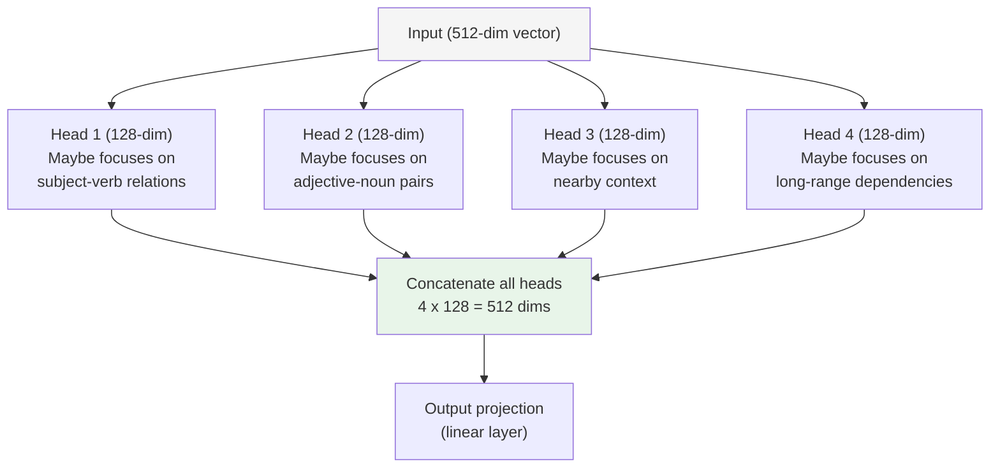

### Causal Masking: "No Peeking"

The model is trained to predict the **next** token. So when processing position 5, it can only look at positions 0-4. It can't peek at position 6+. This is called **causal** (or autoregressive) attention.

```
Position:  0    1    2    3    4    5
Token:    "The" "cat" "sat" "on" "the" "?"

When predicting position 5, can see: "The cat sat on the"
Cannot see: anything after position 5
```

### Sliding Window Attention

Full attention is expensive (every token looks at every earlier token). This model uses a **sliding window** pattern `SSSL`:

```mermaid
graph TD
    subgraph "Window Pattern: SSSL (repeated across 8 layers)"
        L0["Layer 0: <b>S</b>hort window (1024 tokens)<br/>Only looks at nearby context"]
        L1["Layer 1: <b>S</b>hort window (1024 tokens)"]
        L2["Layer 2: <b>S</b>hort window (1024 tokens)"]
        L3["Layer 3: <b>L</b>ong window (2048 = full)<br/>Can see everything"]
        L4["Layer 4: <b>S</b>hort window (1024 tokens)"]
        L5["Layer 5: <b>S</b>hort window (1024 tokens)"]
        L6["Layer 6: <b>S</b>hort window (1024 tokens)"]
        L7["Layer 7: <b>L</b>ong window (forced full)<br/>Last layer always full"]
    end

    L0 --> L1 --> L2 --> L3 --> L4 --> L5 --> L6 --> L7

    style L3 fill:#e8f5e9
    style L7 fill:#e8f5e9
    style L0 fill:#fff3e0
    style L1 fill:#fff3e0
    style L2 fill:#fff3e0
    style L4 fill:#fff3e0
    style L5 fill:#fff3e0
    style L6 fill:#fff3e0
```

**Why?** Short windows are cheaper to compute (less memory, faster). The "L" layers handle long-range connections. It's like having some fast local sensors and a few global ones.

### Flash Attention 3

"Flash Attention" is not a different kind of attention -- it computes the **exact same result** as regular attention, but uses a clever memory-efficient algorithm. Think of it like computing the same integral but with a smarter numerical method.

The code auto-selects the GPU kernel:
- NVIDIA H100 (Hopper architecture, capability 9.0): uses `varunneal/flash-attention-3`
- Other GPUs: uses `kernels-community/flash-attn3`

---

## 7. Positional Encoding: How the Model Knows Word Order

### The Problem

The embedding layer converts each token to a vector, but "The cat sat" and "sat cat The" would produce the same set of vectors (just in different order). The model needs to know **position**.

### RoPE (Rotary Position Embedding)

**Analogy**: Think of a **rotary encoder on a motor shaft**. As the shaft turns, the sin/cos signals tell you the angular position. RoPE does something very similar -- it rotates each token's vector by an angle that depends on its position in the sequence.

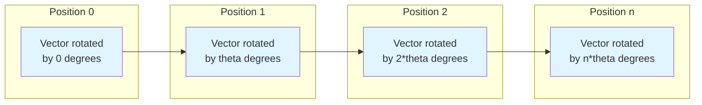

The actual math (from `apply_rotary_emb` in train.py):

```python
# Split each vector into pairs of dimensions
x1, x2 = x[..., :d], x[..., d:]
# Apply 2D rotation using precomputed cos/sin
y1 = x1 * cos + x2 * sin
y2 = x1 * (-sin) + x2 * cos
```

This is literally a **2D rotation matrix** applied to pairs of dimensions. If you've worked with coordinate transforms in robotics, this is the same math!

```
[y1]   [cos  sin] [x1]
[y2] = [-sin cos] [x2]
```

**Why rotation?** Because the dot product between two rotated vectors depends only on the **difference** in their positions (relative position), not their absolute positions. This is elegant and works better than adding fixed position numbers.

---

## 8. The MLP: The Thinking Step

### The Analogy

If attention is the "gather information from context" step, the MLP (Multi-Layer Perceptron) is the "think about it" step. It processes each position independently.

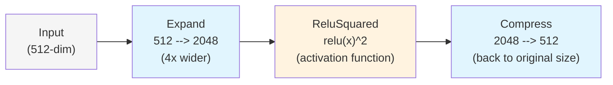

**Why expand then compress?** It's like going from a narrow pipe to a wide mixing chamber and back. The wide layer gives the model more "room to think" before compressing back down. The 4x ratio is a common design choice.

**ReluSquared activation**: Most models use GeLU or ReLU. This model uses `relu(x)^2` -- the squaring makes the activation spikier, which can help the model learn sharper features. Think of it like a non-linear filter that emphasizes strong signals.

---

## 9. Special Tricks in This Model

### 9.1 Residual Connections (Skip Connections)

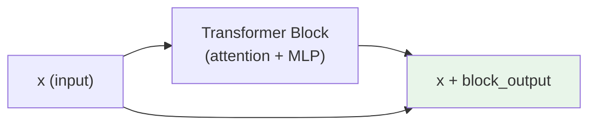

**Analogy**: Like a **bypass valve** in hydraulics. Even if the main processing path has issues, the original signal still flows through. This prevents the "vanishing gradient" problem (where the learning signal gets too weak in deep networks).

### 9.2 x0 Skip Connections (Unique to This Model)

On top of normal residual connections, this model also mixes in the **original** embedding from layer 0:

```python
x = resid_lambdas[i] * x + x0_lambdas[i] * x0
```

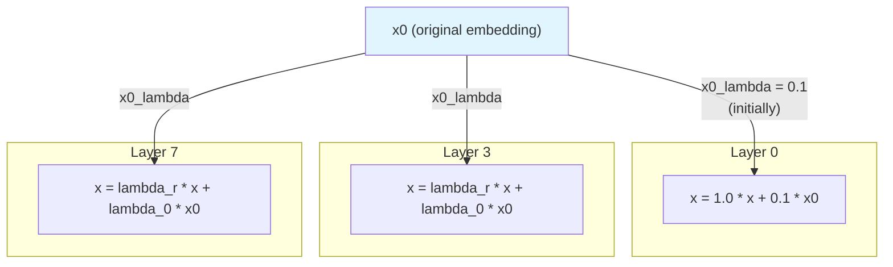

**Analogy**: Like a reference signal in a control system. Every layer gets a "reminder" of the original input. The lambdas are **learnable** -- the model decides how much to mix in.

### 9.3 Value Embeddings (ResFormer)

On alternating layers (0, 2, 4, 6), the model adds **value embeddings** -- a second embedding lookup that directly enriches the attention values:

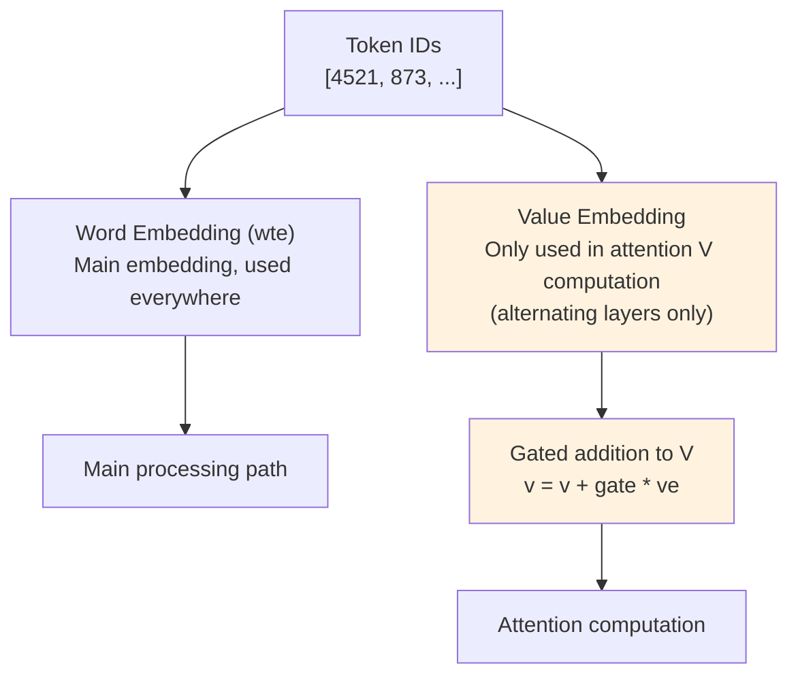

The gate is **learned** -- it starts neutral (1.0) and the model adjusts how much value embedding to mix in. Think of it as giving the attention mechanism extra information channels on some layers.

### 9.4 Logit Soft-Capping

```python
softcap = 15
logits = softcap * torch.tanh(logits / softcap)
```

**Analogy**: Like a **limiter/clamp** on a sensor output. Without it, the model could produce extremely large numbers (logits) that make training unstable. The tanh squashes values to [-15, 15]:

```
Input:   -100  -15   -5    0    5    15   100
Output:  -15   -14.9  -5    0    5    14.9  15
```

Small values pass through unchanged; extreme values get clamped.

### 9.5 RMS Norm (Root Mean Square Normalization)

```python
def norm(x):
    return F.rms_norm(x, (x.size(-1),))
```

**Analogy**: Like **signal conditioning** before feeding data to an ADC. Each vector gets divided by its RMS (root mean square), so all vectors have roughly the same magnitude. This stabilizes training.

Applied before every attention and MLP layer, and once at the final output. It's simpler and faster than the more common "Layer Norm" (no centering step).

---

## 10. The Optimizer: How the Model Learns

### The Analogy

Training a neural network is like finding the lowest valley in a mountain range **blindfolded**. The optimizer is your strategy for choosing which direction to step. A bad optimizer wanders randomly; a good optimizer finds the valley efficiently.

### Two Optimizers in One: MuonAdamW

This model uses a **hybrid** optimizer. Different parts of the model get different optimizers:

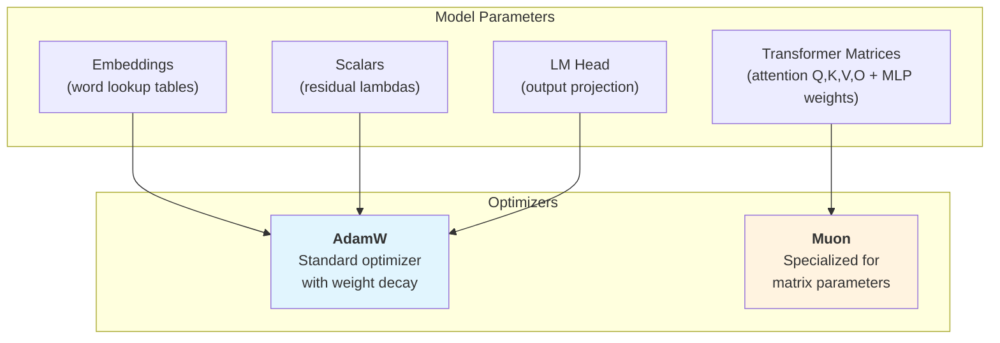

### AdamW (for embeddings, scalars, output head)

**Analogy**: Like a car with **adaptive cruise control**. It maintains a running average of past gradients (momentum) and adapts its step size based on how noisy the gradient is.

- Keeps two "memory" buffers per parameter:
  - `exp_avg`: which direction have we been going? (momentum)
  - `exp_avg_sq`: how noisy is this parameter? (adapt step size)
- **Weight decay**: gradually shrinks weights toward zero, preventing them from growing too large (regularization)

### Muon (for transformer weight matrices)

Muon is a more advanced optimizer designed specifically for large weight matrices. It uses:

1. **Nesterov momentum**: "look ahead" before stepping (better than standard momentum)
2. **Newton-Schulz orthogonalization** ("Polar Express"): mathematically orthogonalizes the gradient matrix. This ensures updates push weights toward **orthogonal matrices**, which have been shown to train better.
3. **NorMuon variance reduction**: normalizes the update to reduce noise

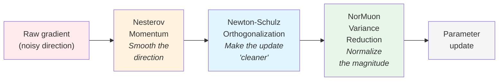

**Analogy**: Standard gradient descent is like walking downhill with a compass. Muon is like walking downhill with a compass, a map, and GPS -- it knows not just which direction to go, but it keeps the path "orthogonal" (efficient, non-redundant).

### Learning Rate Schedule

The learning rate changes over the 5-minute training run:

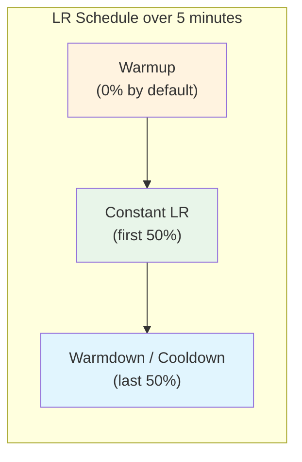

```
LR multiplier
1.0 |████████████████████████████████\
    |                                 \
    |                                  \
    |                                   \
0.0 |____________________________________\___
    0%           50%                   100%
              training time -->
```

**Why warm down?** Like decelerating before stopping a motor. If you keep the learning rate high until the end, the model overshoots and gets worse. Gradually reducing it lets the model "settle in" to a good solution.

---

## 11. The Training Loop: Putting It All Together

### Step-by-Step

```mermaid
sequenceDiagram
    participant DL as DataLoader
    participant GPU as GPU
    participant Model as GPT Model
    participant Opt as MuonAdamW
    participant Time as Timer

    Note over Time: Start 5-minute countdown<br/>(after 10 warmup steps)

    loop Every training step
        DL->>GPU: Load batch (128 x 2048 tokens)

        loop Gradient Accumulation (if needed)
            GPU->>Model: Forward pass (predict next tokens)
            Model->>GPU: Loss (how wrong were predictions?)
            GPU->>GPU: Backward pass (compute gradients)
        end

        GPU->>Opt: Gradients for all parameters
        Opt->>Opt: Update LR based on time progress
        Opt->>GPU: Updated parameters
        GPU->>GPU: Clear gradients

        Note over Time: Check: 5 minutes elapsed?
    end

    Note over Model: Run evaluation on validation data
    Model->>Model: Compute val_bpb
    Note over Model: Print final results
```

### Gradient Accumulation

**The problem**: We want to process 524,288 tokens per step (TOTAL_BATCH_SIZE), but we can only fit 128 sequences x 2048 tokens = 262,144 tokens on the GPU at once.

**The solution**: Process multiple mini-batches and **accumulate** the gradients before updating:

```
tokens_per_fwdbwd = 128 * 2048 = 262,144
grad_accum_steps = 524,288 / 262,144 = 2

So: process 2 mini-batches, accumulate gradients, then update once.
```

**Analogy**: Like averaging multiple sensor readings before making a control decision. More data per decision = smoother, more stable learning.

### The Training Timeline

```mermaid
gantt
    title Training Run Timeline (~5.5 minutes total)
    dateFormat X
    axisFormat %s

    section Startup
    Load model + compile    :0, 30

    section Warmup
    First 10 steps (not timed)  :30, 45

    section Training
    Main training loop (300s)   :45, 345

    section Evaluation
    Compute val_bpb            :345, 365
    Print results              :365, 370
```

The first 10 steps are **warmup** (not counted in the time budget) because PyTorch needs to compile the model on the first run. After that, the 5-minute clock starts.

---

## 12. The Metric: val_bpb

### What Is It?

**val_bpb** = **validation bits per byte**. It measures how well the model predicts text on data it has never seen during training.

### The Analogy

Imagine you're **compressing a file**. A perfect compressor would encode each byte in the minimum possible bits. `val_bpb` measures how close the model is to being a perfect compressor:

| val_bpb | Meaning |
|---------|---------|
| 8.0 | Random guessing (worst possible -- 8 bits per byte, no compression) |
| ~1.0 | Good model (compresses text to about 1 bit per byte, ~8x compression) |
| 0.0 | Perfect prediction (impossible in practice) |

### Why "Bits Per Byte" Instead of "Loss"?

Regular cross-entropy loss depends on the vocabulary size. If you change the tokenizer (e.g., from 8,192 to 16,384 tokens), the loss changes even if the model isn't better or worse. BPB normalizes by the number of **bytes** in the text, making it vocabulary-independent.

```mermaid
graph LR
    LOSS["Model outputs<br/>per-token loss (nats)"]
    BYTES["Token byte lengths<br/>(how many UTF-8 bytes<br/>each token represents)"]

    LOSS --> BPB["val_bpb = sum(nats) / (ln(2) * sum(bytes))<br/><br/><i>Convert nats to bits,<br/>normalize by text length in bytes</i>"]
    BYTES --> BPB

    style BPB fill:#e8f5e9
```

### How Evaluation Works (from prepare.py)

```python
# Evaluate on ~20 million tokens of held-out validation data
EVAL_TOKENS = 40 * 524288  # ~20M tokens

# For each batch of validation data:
# 1. Get per-token loss (cross-entropy in nats)
# 2. Look up how many UTF-8 bytes each token represents
# 3. Skip special tokens (0 bytes)
# 4. Sum up: total_nats / (ln(2) * total_bytes) = BPB
```

---

## 13. Hyperparameters Cheat Sheet

These are the knobs the AI agent can turn in `train.py`:

### Model Architecture

| Parameter | Default | What it controls | Analogy |
|-----------|---------|-----------------|---------|
| `DEPTH` | 8 | Number of transformer layers | Number of filter stages |
| `ASPECT_RATIO` | 64 | model_dim = DEPTH * ASPECT_RATIO | Width of each stage |
| `HEAD_DIM` | 128 | Dimension per attention head | Sensor resolution |
| `WINDOW_PATTERN` | "SSSL" | Which layers use short vs full attention | Local vs global sensors |

### Optimizer

| Parameter | Default | What it controls | Analogy |
|-----------|---------|-----------------|---------|
| `MATRIX_LR` | 0.04 | Learning rate for Muon (weight matrices) | Step size |
| `EMBEDDING_LR` | 0.6 | Learning rate for embeddings | Step size for lookup tables |
| `UNEMBEDDING_LR` | 0.004 | Learning rate for output head | Step size for output layer |
| `WEIGHT_DECAY` | 0.2 | Regularization strength | Damping coefficient |
| `WARMDOWN_RATIO` | 0.5 | Fraction of training spent cooling down LR | Deceleration profile |

### Training

| Parameter | Default | What it controls | Analogy |
|-----------|---------|-----------------|---------|
| `TOTAL_BATCH_SIZE` | 524,288 | Tokens processed per optimizer step | Batch size for averaging |
| `DEVICE_BATCH_SIZE` | 128 | Sequences per GPU forward pass | How much fits in memory |

### Computed Values

```
model_dim      = DEPTH * ASPECT_RATIO = 512  (rounded to HEAD_DIM multiple)
num_heads      = model_dim / HEAD_DIM = 4
MLP hidden dim = 4 * model_dim = 2048
total params   = ~50M
```

---

## 14. Glossary

Quick reference for ML terms used in this codebase, explained through engineering concepts:

| Term | What it means | Engineering analogy |
|------|--------------|-------------------|
| **Tensor** | Multi-dimensional array of numbers | An N-dimensional matrix |
| **Embedding** | Lookup table: integer -> vector | Encoder wheel: position -> voltage |
| **Forward pass** | Running input through the model | Signal flowing through a filter chain |
| **Backward pass** | Computing gradients (how to improve) | Error backpropagation, like computing the Jacobian |
| **Gradient** | Direction of steepest ascent of the loss | The slope of the error surface |
| **Loss** | How wrong the model's predictions are | Error signal (e.g., position error in servo) |
| **Epoch** | One complete pass through all training data | One full cycle through the dataset |
| **Batch** | A group of examples processed together | Parallel sensor readings averaged together |
| **Learning rate** | Step size for parameter updates | Gain in a control loop |
| **Weight decay** | Gradually shrinks weights toward zero | Damping / friction term |
| **Logits** | Raw model outputs before softmax | Unnormalized scores |
| **Softmax** | Converts logits to probabilities (sum to 1) | Normalizing scores to percentages |
| **Cross-entropy** | Loss function for classification | Log-likelihood error metric |
| **bf16 (bfloat16)** | 16-bit floating point format | Half-precision for speed |
| **OOM** | Out of memory (GPU ran out of VRAM) | Stack overflow / buffer overrun |
| **VRAM** | GPU memory | Like RAM but on the graphics card |
| **MFU** | Model FLOP Utilization (% of GPU's theoretical peak) | Like CPU utilization but for math operations |
| **Causal** | Can only look at past tokens, not future | Real-time system (no lookahead) |
| **Residual connection** | Adding input directly to output (skip connection) | Bypass / feedforward path in control |
| **Norm** | Normalizing vectors to consistent magnitude | Signal conditioning |
| **Autoregressive** | Generating one token at a time, feeding it back | Recurrence / feedback loop |

---

## Visual Summary: Everything Connected

```mermaid
graph TD
    subgraph "HUMAN LAYER"
        H["Human writes program.md<br/>(experiment strategy)"]
    end

    subgraph "AGENT LAYER"
        A["AI Agent (Claude/Codex)<br/>Reads program.md<br/>Modifies train.py"]
    end

    subgraph "CODE LAYER"
        P["prepare.py<br/>(fixed infrastructure)"]
        T["train.py<br/>(model + training loop)"]
    end

    subgraph "DATA LAYER"
        D["~/.cache/autoresearch/<br/>Text shards + tokenizer"]
    end

    subgraph "COMPUTE LAYER"
        GPU["Single NVIDIA GPU<br/>5-minute training runs"]
    end

    subgraph "RESULTS LAYER"
        R["results.tsv<br/>Experiment history"]
        M["val_bpb metric<br/>Lower = better"]
    end

    H -->|"instructs"| A
    A -->|"edits"| T
    P -->|"provides data +<br/>evaluation"| T
    D -->|"loaded by"| P
    T -->|"runs on"| GPU
    GPU -->|"produces"| M
    M -->|"logged to"| R
    R -->|"informs next<br/>experiment"| A

    style H fill:#e1f5fe
    style A fill:#fff3e0
    style T fill:#fce4ec
    style P fill:#e8f5e9
    style GPU fill:#f3e5f5
    style M fill:#e8f5e9
```

---

*This document was generated to help engineers from non-ML backgrounds understand the autoresearch codebase. The code itself is based on Andrej Karpathy's work and is a simplified single-GPU implementation of [nanochat](https://github.com/karpathy/nanochat).*
